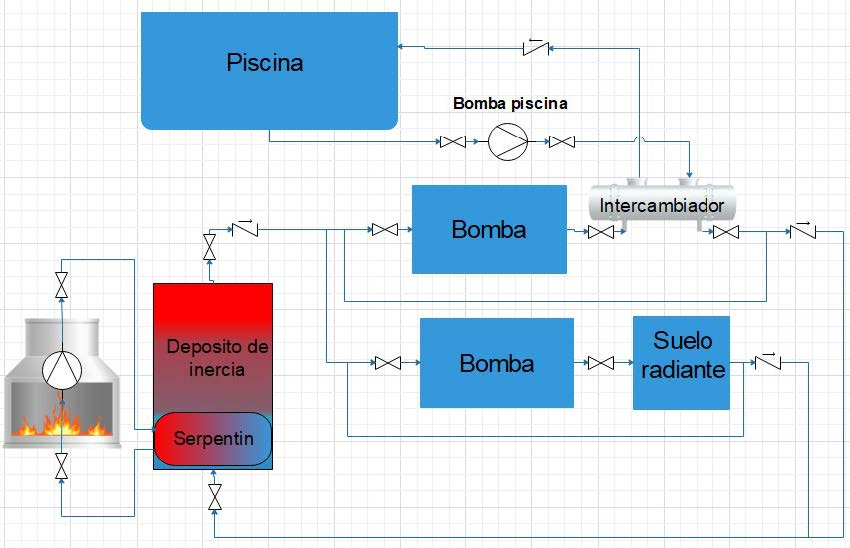
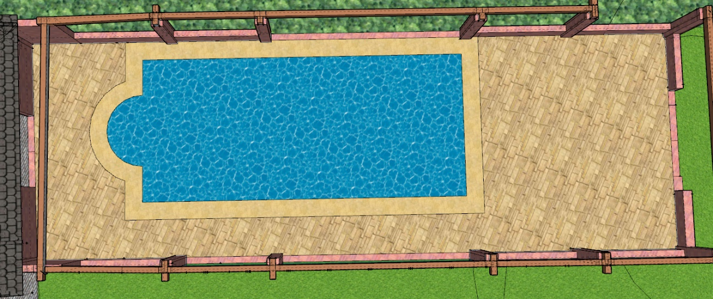

# poolGUI
GUI created in Qt  5.14 to control an indoor swimming pool heating system coupled with a heating floor installtion in order to control pool water temperature and ambient temperature.

The system can be used as a heating system employing an enviromental friendly boiler or it can act as a refrigeration system using the pool as heat sink. 

***
### Hardware
- Raspberry Pi 4 (Raspberry Pi OS with desktop )
### Project hardware
- Arduino Mega 2560
- Custom power source board
- Custom Arduino shield 

### Communications
- UART serial comunications with custom protocol
- The protocol is based on [this](https://github.com/vigasan/SerialCom) with some modifications for robustness
    - Lightweight
    - It has message integrity check by checksum
    - It lacks of error handling
    - It lacks of acknoledgment

### Improvements [TODOs]:
- Clear unused code (Themes...)
- Add extra configuration screen for hyperparameters
- In refrigeration mode:
    - Add control by pool delta
    - Add extra label showing pool delta
- Design new hardware with extra inputs to detect valve position (active when ground)
- Switch to CAN bus
    - Error message handling
    - Acknoledgment of messages
- Add fan control hardware and software

***
## Instalation schema

## Pool rendering
